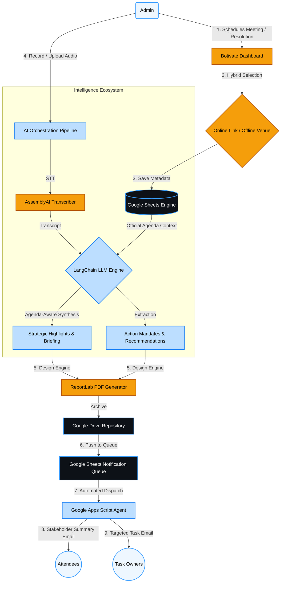

# Botivate: Agentic Minutes of Meeting (MOM) System


Botivate is an intelligent, agentic system designed to autonomously handle, analyze, and document your meeting minutes on autopilot. By leveraging cutting-edge AI capabilities (OpenAI and AssemblyAI), Botivate transforms unstructured meeting interactions into highly structured, actionable intelligence, now fully integrated with Google Workspace for seamless enterprise cloud storage.

## 🚀 Key Features

- **Strategic AI Intelligence (Agenda-Aware):** AI maps discussions directly to the **Official Agenda**, distinguishing between "Material Strategic Figures" (e.g., Invested Capital) and "Conversational Noise" (e.g., minor calculation errors) for outcome-focused reports.
- **Intelligent Task Extraction:** Automatically isolates, categorizes, and assigns **Action Items** and **Recommended Tasks** from meeting segments.
- **Automated Notification Ecosystem:** Dispatches professional summary emails, task assignments, and absence warnings. Uses a **Google Sheets-backed Queue** (processed via Google Apps Script) to bypass cloud port restrictions and ensure 100% email delivery.
- **Hybrid Meeting Modes:** Supports both **Online** (Zoom/Meet/Teams links with word-wrap support) and **Offline** (Physical venue tracking) meeting setups.
- **Dynamic PDF Integration:** Meticulously styled Executive Briefing and MOM PDFs with **Full Unicode support (Rupee ₹ symbol)** and professional Markdown rendering.
- **Google Cloud Archive:** Full enterprise integration with **Google Sheets** (database) and **Google Drive** (hierarchical folder-based storage).
- **Flawless Speech-to-Text:** Uses AssemblyAI for high-fidelity multilingual transcription (Hindi, English, Hinglish).
- **Board Resolution (BR) Management:** Formal workflow for high-stakes governance with specialized branding and automated compliance tracking.
- **Modern & Premium UI:** Sleek, minimalist design featuring glassmorphism, responsive detail cards, and brand-consistent dark/light modes.

---

## 🧠 System Architecture & Workflow

Below is the high-level workflow of the Botivate Agentic MOM System, outlining how raw data translates into automated cloud-backed archival.



---

## 🛠 Tech Stack

### Frontend
- **React 18** + **Vite**
- **TypeScript**
- **Tailwind CSS v3** (Custom Brand System)
- **Recharts** for Analytics
- **Heroicons / Radix Icons**
- **Zustand** for State Management
- **React Query** for Data Fetching & Caching

### Backend
- **Python 3.10+**
- **FastAPI** (High-performance API framework)
- **LangChain & OpenAI API** (GPT-4o-mini for logical synthesis and mapping/reducing)
- **AssemblyAI** (For highly accurate cloud-based Audio Transcription)
- **Google Sheets API v4** (Real-time Cloud Database and **Email Queuing System**)
- **Google Drive API v3** (Hierarchical Document Storage and Sharing)
- **ReportLab** (Dynamic, aesthetic PDF generation)
- **Google Apps Script** (Automated serverless email processing & delivery)

---

## 📂 Project Structure

```text
📦 MOM_AI_Assistant
 ┣ 📂 backend
 ┃ ┣ 📂 app
 ┃ ┃ ┣ 📂 ai                # Langchain logic, STT config, LLM Prompts
 ┃ ┃ ┣ 📂 api               # FastAPI route endpoints (Meetings, Analytics, Dashboard)
 ┃ ┃ ┣ 📂 models            # Enums & Pydantic validation schemas
 ┃ ┃ ┣ 📂 services          # Core logic (Google Sheets, AssemblyAI, Automation)
 ┃ ┃ ┣ 📂 notifications     # SMTP Email agent & PDF design engine 
 ┃ ┃ ┗ 📜 main.py           # Application entrypoint
 ┃ ┣ 📜 requirements.txt    # Python dependencies
 ┃ ┣ 📜 .env                # API Keys & Cloud Credentials
 ┃ ┗ 📜 google_credentials.json # Service Account Secret
 ┣ 📂 frontend
 ┃ ┣ 📂 src
 ┃ ┃ ┣ 📂 components        # Reusable UI elements (Drawers, Cards, Modals)
 ┃ ┃ ┣ 📂 pages             # Application views (Dashboard, Meeting workflows)
 ┃ ┃ ┣ 📜 App.tsx           # Router configuration
 ┃ ┃ ┗ 📜 index.css         # Global Tailwind directives & Brand tokens
 ┃ ┣ 📜 tailwind.config.js  # Deep-customized brand theme
 ┃ ┗ 📜 package.json        # Node dependencies
 ┣ 📜 README.md             # Project Overview
 ┗ 📜 SETUP.md              # Installation & Deployment instructions
```

---

## ℹ️ Setup & Installation

Please refer to the [SETUP.md](SETUP.md) for local installation and the [CREDENTIALS_GUIDE.md](CREDENTIALS_GUIDE.md) for a detailed step-by-step on obtaining all necessary API keys (OpenAI, AssemblyAI, Gmail SMTP, Google Cloud).

---
*Botivate Services LLP © 2026. Powering Businesses On Autopilot.*