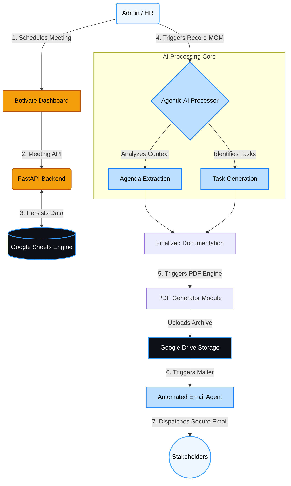

# Botivate: Agentic Minutes of Meeting (MOM) System


Botivate is an intelligent, agentic system designed to autonomously handle, analyze, and document your meeting minutes on autopilot. By leveraging AI capabilities, Botivate transforms unstructured meeting interactions into highly structured, actionable intelligence, now fully integrated with Google Workspace for seamless enterprise cloud storage.

## 🚀 Key Features

- **Agentic Summarization:** The system autonomously drafts MOMs (Minutes of Meeting), identifies key topics, and maps conversations to specific agendas.
- **Intelligent Task Extraction:** Action items are automatically isolated, categorized, and assigned to respective owners without manual intervention.
- **Google Cloud Integration:** Full archival system using **Google Sheets** as a database and **Google Drive** for secure document storage.
- **Board Resolution (BR) Management:** Specialized workflow for high-stakes resolutions with meeting-specific folder archival and governance evidence tracking.
- **Automated Notifications:** Botivate automatically sends professional summary emails with dynamically generated, meticulously styled **PDF attachments**.
- **Rich Analytics Dashboard:** Gain deep insights into team productivity, meeting frequency trends, attendance rates, and action-item completion metrics.
- **Modern & Premium UI:** Designed with a sleek, minimalist dark/light mode interface characterized by glassmorphism, dynamic animations, and brand-consistent styling.

---

## 🧠 System Architecture & Workflow

Below is the high-level workflow of the Botivate Agentic MOM System, outlining how raw data translates into automated cloud-backed archival.



---

## 🛠 Tech Stack

### Frontend
- **React 18** + **Vite**
- **TypeScript**
- **Tailwind CSS v3** (Custom Brand System)
- **Recharts** for Analytics
- **Heroicons** for SVG Iconography
- **Zustand** for State Management
- **React Query** for Data Fetching & Caching

### Backend
- **Python 3.10+**
- **FastAPI** (High-performance API framework)
- **Google Sheets API** (Real-time Cloud Database)
- **Google Drive API** (Hierarchical Document Storage)
- **ReportLab** for dynamic, aesthetic PDF Generation
- **FastAPI-Mail** for asynchronous Email Delivery

---

## 📂 Project Structure

```text
📦 MOM_AI_Assistant
 ┣ 📂 backend
 ┃ ┣ 📂 app
 ┃ ┃ ┣ 📂 api               # FastAPI route endpoints (Meetings, BR, Dashboard)
 ┃ ┃ ┣ 📂 models            # Enums & Shared Types
 ┃ ┃ ┣ 📂 schemas           # Pydantic validation schemas
 ┃ ┃ ┣ 📂 services          # Core logic (Google Sheets service, AI extraction)
 ┃ ┃ ┣ 📂 notifications     # Email server & PDF Generation logic
 ┃ ┃ ┗ 📜 main.py           # Application entrypoint
 ┃ ┣ 📜 requirements.txt    # Python dependencies
 ┃ ┣ 📜 .env                # API Keys & Cloud Credentials
 ┃ ┗ 📜 google_credentials.json # Service Account Secret (Git Ignored)
 ┣ 📂 frontend
 ┃ ┣ 📂 src
 ┃ ┃ ┣ 📂 components        # Reusable UI components (Stats, Drawers, Layout)
 ┃ ┃ ┣ 📂 pages             # Application views (Dashboard, BR Logs, Meetings)
 ┃ ┃ ┣ 📂 store             # Zustand global state (Theme)
 ┃ ┃ ┣ 📜 App.tsx           # Router configuration
 ┃ ┃ ┗ 📜 index.css         # Global Tailwind directives & Brand tokens
 ┃ ┣ 📜 tailwind.config.js  # Deep-customized brand theme
 ┃ ┗ 📜 package.json        # Node dependencies
 ┣ 📜 README.md             # Project Overview
 ┗ 📜 SETUP.md              # Installation & Deployment instructions
```

---

## ℹ️ Setup & Installation

Please refer to the [SETUP.md](SETUP.md) file for comprehensive, step-by-step instructions on configuring your Google Cloud Project, running Botivate locally, and deploying it.

---
*Botivate Services LLP © 2026. Powering Businesses On Autopilot.*